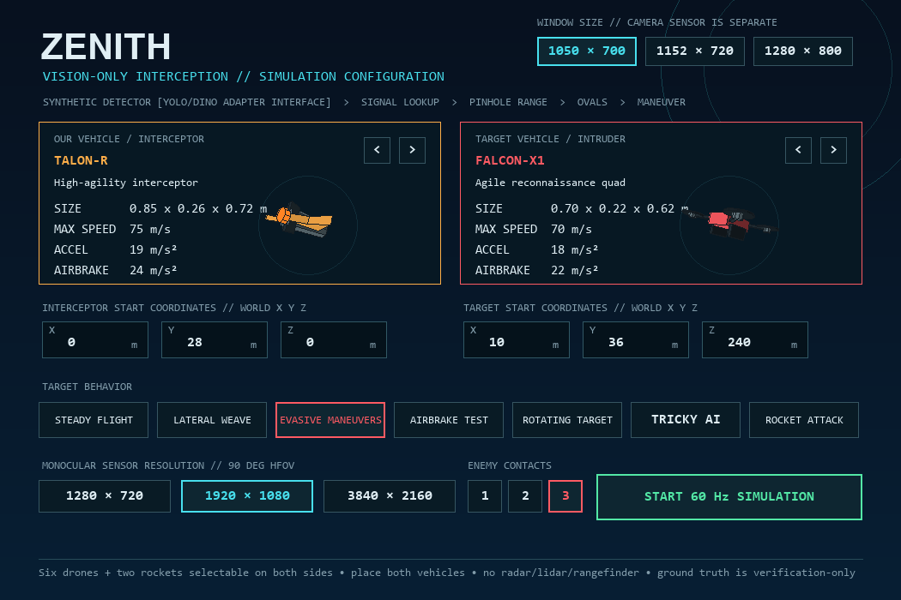
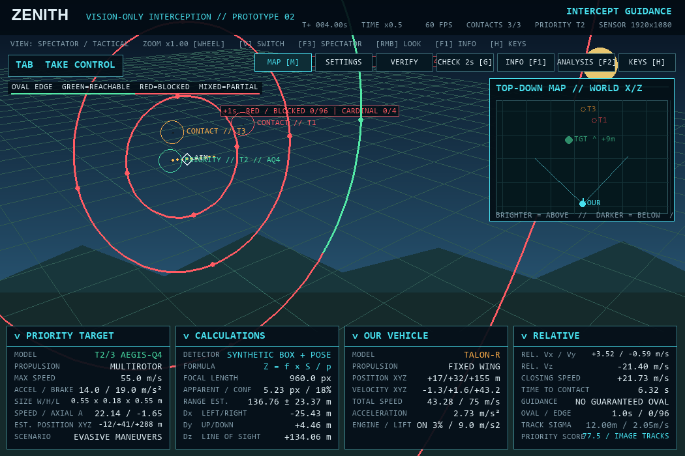
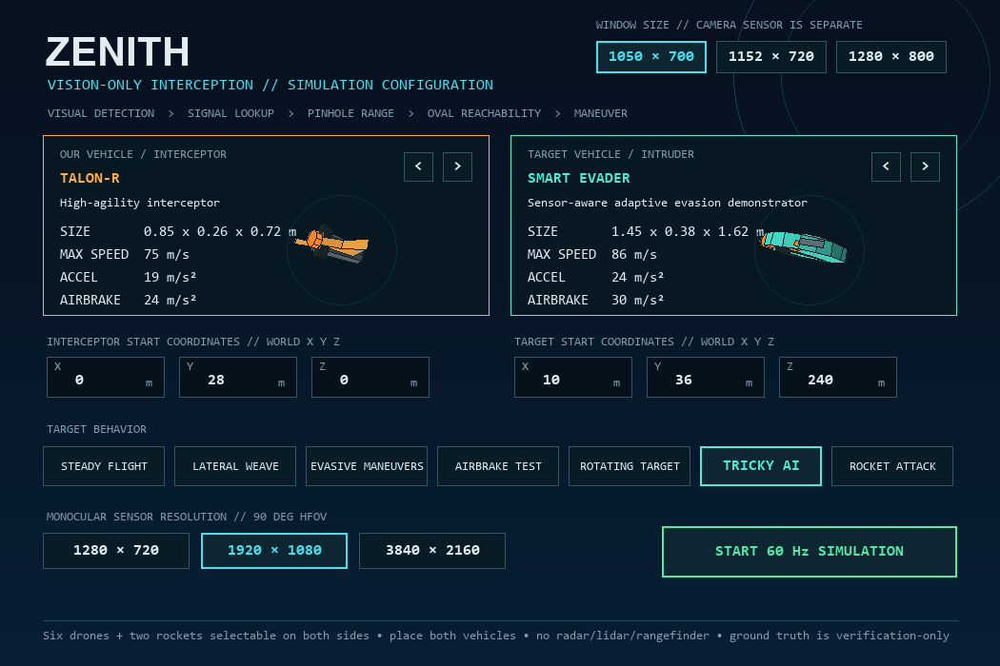
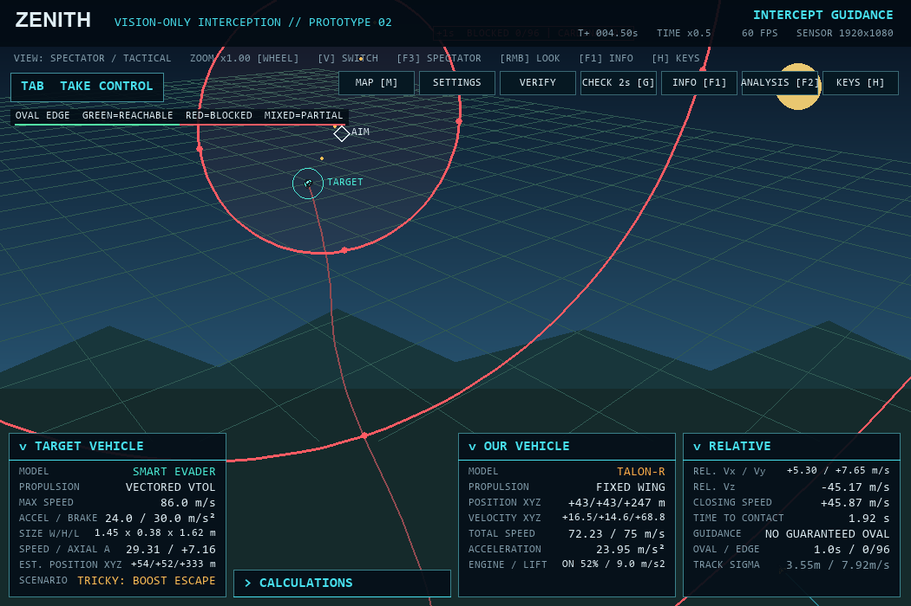
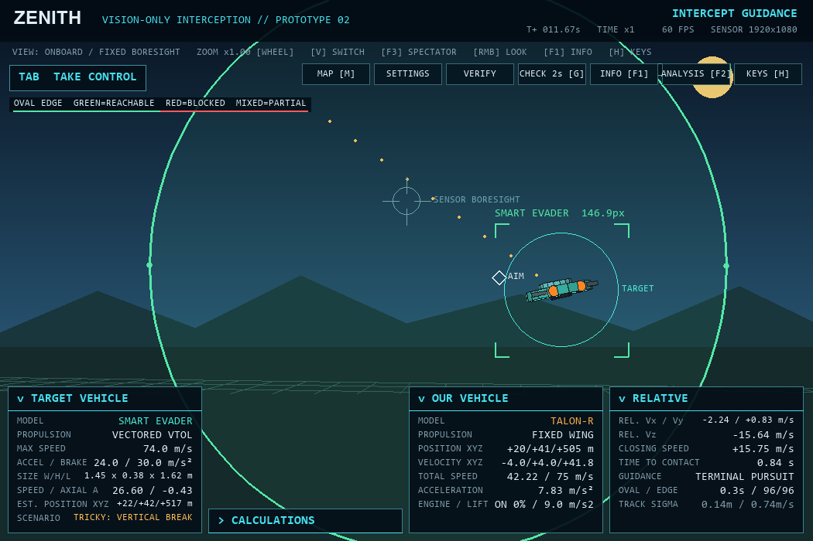
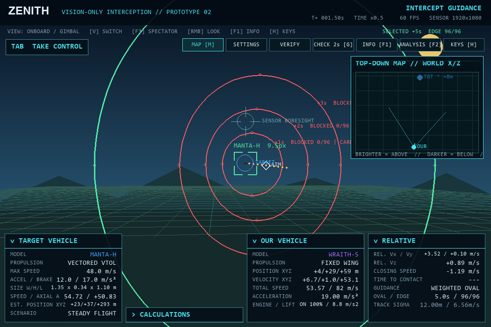
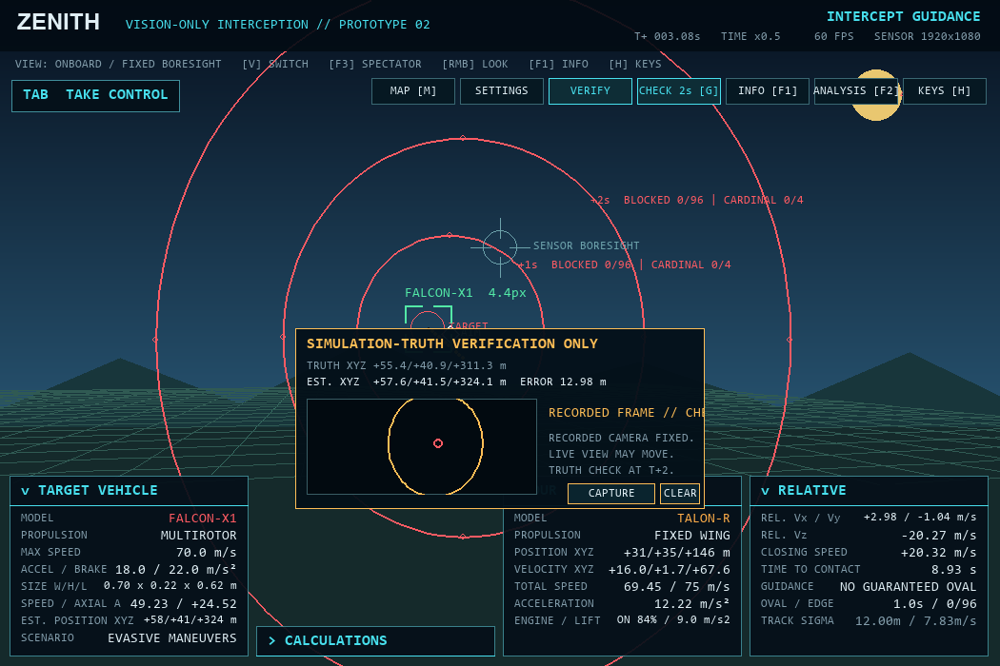
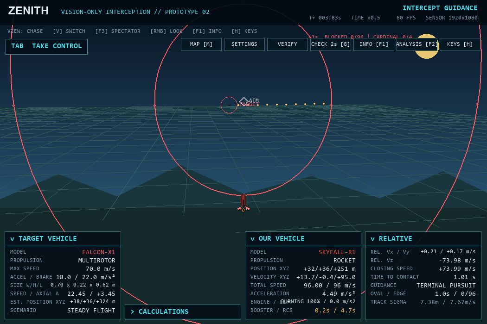
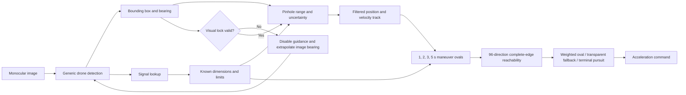

# ZENITH

ZENITH is a windowed interactive desktop proof-of-concept for vision-only interception. It estimates an intruder's range from a monocular camera, builds conservative maneuver-containment ovals, and outputs the maneuver for a propulsion-constrained interceptor. No radar, lidar, rangefinder, or target ground-truth coordinates are used by the guidance calculation.

The project includes six controllable drones with distinct low-poly quadcopter, swept-wing, delta-wing, blended-wing, and directional UFO-style meshes. `WRAITH-S` is the fastest drone; `TALON-R` turns harder; and `SMART EVADER` combines high acceleration, braking, and turn authority with a separate threat-aware `TRICKY AI` behavior. The setup can launch one, two, or three enemy contacts. Every contact gets an independent detection, signal identity, range/velocity track, oval solution, and camera-derived threat score; a hysteresis delay prevents the selected priority target from flickering between nearly equal tracks. Two literal single-stage rockets are selectable on either side. Each ignites automatically, expends a finite nonrestartable booster, uses a separate limited RCS steering budget, and then coasts under drag and gravity.


















[Full information page 1: sensor/readouts](artifacts/info_page_1.png) ·
[page 2: ovals/guidance](artifacts/info_page_2.png) ·
[page 3: gravity/aerodynamics](artifacts/info_page_3.png) ·
[page 4: lock loss/cameras/verification](artifacts/info_page_4.png)




## Run it

On Windows, double-click `run_zenith.bat`. The application is DPI-aware, opens in a resizable 1050 × 700 window, and is not fullscreen even when Windows display scaling is 125% or 150%. The setup screen offers 1050 × 700, 1152 × 720, and 1280 × 800 window sizes independently of the simulated camera resolution.

Or run it from a terminal:

```powershell
python -m pip install -r requirements.txt
python app.py
```

The installed environment needs Python 3.11+ and Pygame 2.6+.

## Recommended first demonstration

1. Keep `TALON-R` as our interceptor and `FALCON-X1` as the target.
2. Select `EVASIVE MANEUVERS`, `1920 × 1080`, and start the simulation. For the multi-target demonstration, also select `3` under `ENEMY CONTACTS`.
3. Observe the target label change from `UNKNOWN / QUERYING` to `FALCON-X1`.
4. Point out the 1, 2, 3, and 5 second prediction ovals. The four large dots are the cardinal summary, but the border color tests all 96 displayed edge directions. Green segments are reachable and red segments are blocked; only a completely green `96/96` edge can be selected and receive a faint green fill. Red never fills the center.
5. Press `F2` to show the camera-resolution and range-error analysis.
6. Press `V` to cycle views or `F3` to jump directly to the independent spectator/tactical view. Hold the right mouse button to capture the pointer for unlimited free look; hold `Shift` while moving it to roll the presentation camera. Use the mouse wheel to zoom without changing the sensor. Release the button to restore the pointer, or press `C` to center the view and reset zoom.
7. Press `O` to obscure the camera: lock, guidance, range, and ovals disappear immediately. Press `O` again and watch the search pattern genuinely reacquire the target.
8. Click the bottom headers to expand/collapse individual panels. Press `M` for the estimated-track minimap and `G` to record a two-second prediction check in the old virtual camera frame.
9. Press `Tab` to take over our vehicle, then press it again to take over the target. Use `W/S`, `A/D`, `Q/E`, `Shift`, and `Ctrl`; the authority HUD proves which requests each propulsion model can execute. `X` cuts/restarts a drone engine, while a solid rocket correctly rejects that request.
10. Start a new simulation with `SMART EVADER` as the target and select `TRICKY AI`. Its Target panel and event log expose deterministic decisions such as jinks, climbs, speed shifts, brake traps, and escape boosts.
11. Select `SKYFALL-R1` or `LANCE-M2` as **our interceptor**, and show the automatic booster/RCS timers. Rockets remain selectable as incoming targets too.
12. Press `F5` to export the run's verification telemetry, including the current target-AI decision.

## Controls

| Key | Action |
|---|---|
| `Space` | Pause or continue |
| `+` / `-` | Change time scale from 0.25× to 4× |
| `V` | Cycle onboard, chase, and spectator/tactical views |
| `F3` | Jump directly to spectator/tactical view |
| `F4` | Toggle presentation settings |
| Hold right mouse | Capture the pointer for unlimited free look |
| `Shift` + right mouse | Roll the presentation camera |
| Mouse wheel | Zoom the presentation camera; the simulated sensor remains 90° |
| `C` | Center free look and reset presentation zoom |
| `Tab` | Cycle `AUTO -> PLAYER / OUR VEHICLE -> PLAYER / TARGET -> AUTO` |
| `W` / `S` | Forward thrust / reverse or decelerate |
| `A` / `D` | Turn left / right within propulsion limits |
| `Q` / `E` | Descend / climb; release to hold the assisted altitude |
| `Shift` | Request full available maneuver authority |
| `Ctrl` | Airbrake where the selected vehicle supports one |
| `X` | Cut/restart a drone engine; solid rocket boosters cannot be cut or restarted |
| `M` | Toggle the top-down estimated-track minimap |
| `G` | Record a two-second prediction check in the saved camera frame |
| `F1` | Toggle the four-page full system information reference |
| `F2` | Toggle engineering analysis |
| `H` | Toggle help |
| `O` | Toggle camera occlusion for lock-loss/reacquisition proof |
| `F5` | Export verification telemetry as CSV |
| `R` | Restart the current setup |
| `N` | Start a new setup |
| `Esc` | Close an overlay, then exit |

## What the four panels mean

- `PRIORITY TARGET`: the selected contact ID plus drone or rocket specifications obtained after visual detection and simulated signal lookup.
- `CALCULATIONS`: detector adapter, focal length, apparent target size, estimated range, uncertainty, and camera-relative `Dx/Dy/Dz`. This panel starts expanded.
- `OUR VEHICLE`: propulsion model, world position, velocity, acceleration, engine/lift, and rocket booster/RCS timers where applicable.
- `RELATIVE`: camera-relative velocity, closing speed, contact time, selected guidance solution, complete-edge result, track uncertainty, and image-track priority score.

Each panel header is independently clickable. Target truth and error appear only in the separately expanded `SIMULATION-TRUTH VERIFICATION` window.

`X` is camera-left/right, `Y` is camera-up/down, and `Z` is the line from the camera toward the target.

## System pipeline



The defense guidance never reads the simulation's exact target position: truth is used to create the synthetic detector output, detect physical contact, and calculate the explicitly marked verification error. The guidance path reads each detector box, vehicle-center image keypoint, bearing, pose output, signal-resolved model data, successive camera-derived position measurements, and our drone's own integrated state. Target velocity and acceleration are estimated from changes between those image-derived measurements; they are not copied from a target's simulated state. Floating-point detector boxes preserve subpixel motion, while explicit half-pixel uncertainty still represents finite image resolution. This avoids a false 3 px to 4 px range discontinuity. The optional `TRICKY AI` target controller is a separately declared adversary test harness: because that scenario assumes the enemy knows about us, it reads our true relative approach to choose its own bounded maneuver, but cannot feed truth back into detection or guidance. The sensor is rigidly body-mounted: it cannot turn toward truth, preserve lock with a hidden gimbal, or see behind the airframe. AEGIS-Q4 and SMART EVADER publish a fixed 6° upward camera cant and a 24° body-tilt limit so their automatic maneuver controller does not repeatedly throw its own forward camera across the vertical FOV boundary. A lost visual detection invalidates guidance immediately; the last metric track is not coasted as if it were a current lock. The search system filters the final image-plane bearing rate, extrapolates it for at most 1.5 seconds, then asks the autonomous interceptor airframe to perform a widening horizon-limited scan while holding altitude and about half maximum speed. If the player controls our vehicle, only the player can turn the body and therefore the camera.

At every 60 Hz update the current sensor pose is frozen and each mathematical ellipse bounds the pixels the identified target could occupy after 1, 2, 3, or 5 seconds. The bound includes propulsion support, perspective at the closest permitted future depth, and the track's position/velocity uncertainty. It is then back-projected onto the plane through the estimated target, perpendicular to the current optical axis. If the future set could cross the camera plane, the horizon is labeled `UNBOUNDED / CAMERA CROSSING` instead of drawing a dishonest finite oval.

The four large marked points remain the easy cardinal explanation. They do not prove the diagonal edge: the actual decision checks all 96 directions used to render the border. Each reachable edge segment is green and each blocked segment is red, so partial reachability is visibly mixed; the label still reports `n/96`. Only a completely green border gets a faint green interior tint. Red is never used as an interior fill because failure at the outer border does not imply that the center is unreachable. Guidance chooses only the largest completely green oval and biases its aim from the center toward measured likely motion while remaining within 65% of the ellipse. With no green oval it explicitly reports `NO GUARANTEED OVAL` and follows the unchanged-motion prediction. Reaching the one-second region activates terminal collision lead.

Mouse free-look and wheel zoom change only the presentation renderer, not the sensor axis, detection, or guidance. The zoom is a bounded 24°–100° presentation field of view; the sensor remains fixed at its configured 90°. While the right button is held, the pointer is captured and hidden so window edges cannot stop rotation; release, focus loss, overlays, or simulation exit restore it. Vehicle key input is suppressed during mouse capture so `Shift` can roll without also commanding thrust.

Manual takeover is an advisory proof mode rather than a physics bypass. Inputs pass through the same thrust direction, airbrake, turn rate, speed, drag, gravity, wing lift/stall, fuel, tilt, and altitude constraints used by autonomy. Aegis-Q4 and Smart Evader begin level with zero vertical velocity at half maximum speed; the corrected vectored attitude model visibly tilts the nose down for forward thrust while respecting their camera-preserving body limit. A powered rotorcraft must spend thrust to hover; an engine-off wing glides before sinking. Fixed-wing autonomy avoids overspeed by scheduling throttle and closing speed early; a negative request cuts propulsion and lets drag slow the aircraft instead of inventing reverse thrust or an automatic speed-triggered brake. A rocket automatically burns at full thrust, cannot reverse/throttle/restart, steers only while RCS remains, and falls after burnout. During our-vehicle takeover, the normal oval solution remains visible as an advisory.

`F1` opens a four-page in-app reference. The fixed `SENSOR BORESIGHT` appears only in onboard sensor view; the separate diamond is the actual world-space guidance aim. `M` opens an X/Z minimap with the sensor FOV wedge and altitude-coded target marker. `G` records a two-second prediction in its original virtual camera frame so moving or rotating the live camera cannot invalidate the comparison.

## Verification

Run all seven deterministic behavior tests:

```powershell
python verify_prototype.py --duration 30 --csv artifacts\verification.csv
python -m unittest discover -v
python benchmark_performance.py
python benchmark_performance.py --enemies 3
```

The verifier reports identification, interception result, hit time, minimum separation, and range-estimation MAE/RMSE. The automated suite additionally checks all 96 edge directions, green-only fill semantics, diagonal failure despite `4/4` cardinals, weighted-point limits, camera-crossing invalidation, detector-pose isolation, subpixel range continuity, frame-stable rendered oval radii, level Aegis/Smart starts, correct vectored pitch direction, saved-frame two-second containment, every drone as a baseline interceptor, half-speed no-lock cruise, onboard-only boresight, finite rocket burnout/RCS, both rockets as interceptors and targets, visual lock loss/reacquisition, gravity/aerodynamics, and every default interception scenario.

The benchmark runs the same evasive simulation and complete 1050 × 700 software-rendering path repeatedly without opening a window. Its numbers are machine-dependent; it does not reduce the fixed 60 Hz physics rate or skip any of the 96 displayed edge checks.

## Project structure

```text
app.py                    Desktop UI, setup screen, controls, CSV export
verify_prototype.py       Deterministic seven-scenario verification
benchmark_performance.py  Repeatable physics/guidance/render benchmark
zenith/
  camera.py               Pinhole camera, detector output, range estimator
  controls.py             Manual authority modes and assisted flight requests
  guidance.py             Tracking, prediction ovals, reachability, commands
  math3d.py               Vector, camera-basis, and transform mathematics
  models.py               Six drones and two controllable rocket profiles
  meshes.py               Bundled procedural drone and rocket polygon meshes
  physics.py              60 Hz gravity, lift/stall, thrust, drag, and impacts
  rendering.py            3D scene, HUD, spectator, analysis, full info display
  simulation.py           Detection → signal → guidance state machine
tests/test_core.py        Automated numerical and scenario checks
docs/TECHNICAL_REPORT.md  Equations, assumptions, degradation analysis
docs/PRESENTATION_GUIDE.md Suggested presentation and likely questions
docs/VERIFICATION_AUDIT.md Requirement-to-code-and-test evidence matrix
```

## Prototype boundary

There is no trained neural image-recognition model or downloaded weight file in this milestone, so the UI deliberately labels the active backend `SYNTHETIC BOX + POSE`. The generic visual detector is a deterministic synthetic-camera adapter: simulation truth is used inside that adapter to emit a floating-point 2D box, vehicle-center image keypoint, bearing, confidence, and imperfect pose estimate for every contact—the outputs a real detection/keypoint/pose stack would provide. Defense estimation and guidance consume only those outputs. Model identity deliberately does **not** come from the detector; it becomes available through the simulated post-detection signal lookup described in the project idea. `ImageDetectorAdapter` in `zenith/camera.py` defines the optional sensor-frame boundary for a later YOLO or DINO backend. Such a backend still needs model weights, its matching Python dependencies, and rendered or physical camera frames; none are silently downloaded or falsely claimed here. It can replace the detector layer without changing range, tracking, priority selection, guidance, or HUD code.

The aerodynamic layer is intentionally a verifiable presentation model, not computational fluid dynamics: gravity is exact, while lift uses exposed stall-speed and lift-efficiency parameters plus the current flight-path direction and airspeed. A production vehicle would require measured lift/drag curves, mass, wing area, wind, control-surface dynamics, and hardware validation.

## Optional external model sources

The bundled meshes are original project code, so the prototype has no asset-license dependency. If higher-detail assets are wanted later:

- [NASA 3D Resources](https://science.nasa.gov/3d-resources/) provides downloadable rocket and spacecraft assets under NASA's media-usage guidance.
- [NASA Atlas V 401 glTF](https://science.nasa.gov/resource/atlas-v-401-3d-model/) is an official 2.08 MB rocket model.
- [Kira's Drone on Sketchfab](https://sketchfab.com/3d-models/drone-eac2b4bc20f54b3ba8c3ddbcdf03c8d6) is downloadable under CC Attribution, but its 275k triangles require simplification before use in this software renderer.
- [Khronos glTF Sample Assets](https://github.com/KhronosGroup/glTF-Sample-Assets) is a useful reference for a future standards-based importer; individual asset licenses must still be checked.
