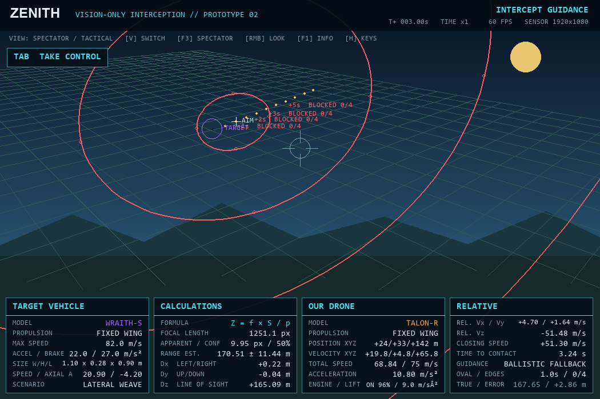
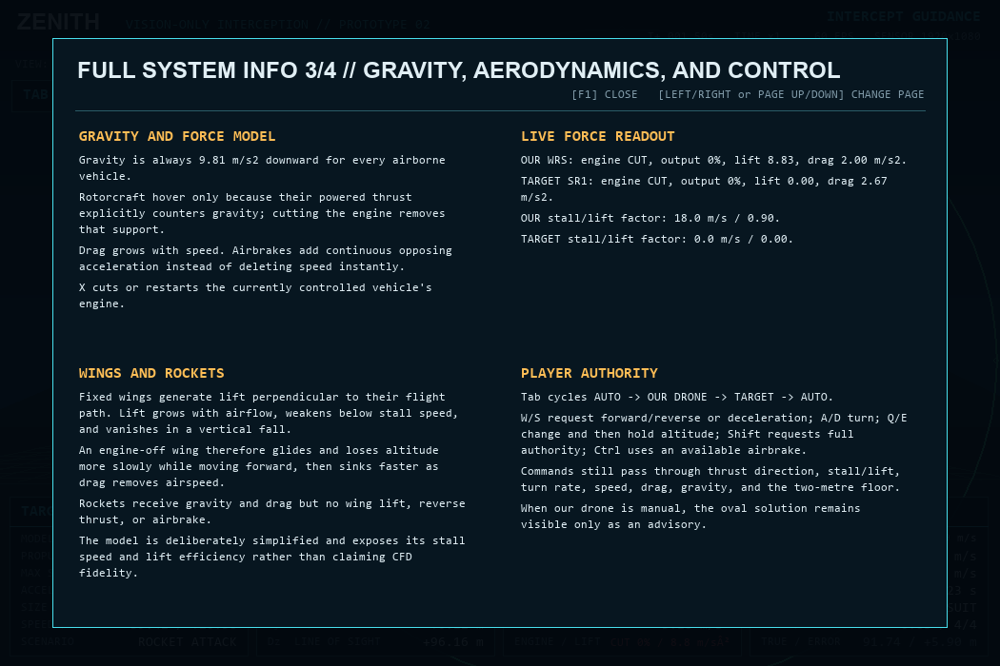
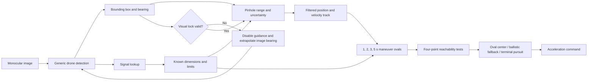

# ZENITH

ZENITH is a windowed interactive desktop proof-of-concept for vision-only interception. It estimates an intruder's range from a monocular camera, builds conservative maneuver-containment ovals, and outputs the maneuver for a propulsion-constrained interceptor. No radar, lidar, rangefinder, or target ground-truth coordinates are used by the guidance calculation.

The project includes five controllable drones with distinct low-poly quadcopter, swept-wing, delta-wing, and blended-wing meshes. Two rocket profiles add nose cones, cylindrical bodies, fins, exhausts, incoming-flight physics, and rocket-specific interception messages; rockets can also be taken over during a demonstration.






[Full information page 1: sensor/readouts](artifacts/info_page_1.png) ·
[page 2: ovals/guidance](artifacts/info_page_2.png) ·
[page 3: gravity/aerodynamics](artifacts/info_page_3.png) ·
[page 4: lock loss/cameras/verification](artifacts/info_page_4.png)


## Run it

On Windows, double-click `run_zenith.bat`. The application is DPI-aware, opens in a resizable 1050 × 700 window, and is not fullscreen even when Windows display scaling is 125% or 150%. The setup screen offers 1050 × 700, 1152 × 720, and 1280 × 800 window sizes independently of the simulated camera resolution.

Or run it from a terminal:

```powershell
python -m pip install -r requirements.txt
python app.py
```

The installed environment needs Python 3.11+ and Pygame 2.6+.

## Recommended first demonstration

1. Keep `TALON-R` as our interceptor and `FALCON-X1` as the target.
2. Select `EVASIVE MANEUVERS`, `1920 × 1080`, and start the simulation.
3. Observe the target label change from `UNKNOWN / QUERYING` to `FALCON-X1`.
4. Point out the 1, 2, 3, and 5 second prediction ovals. A green border means all 4 required extremes are reachable. A red border means at least one failed; its label gives the exact count.
5. Press `F2` to show the camera-resolution and range-error analysis.
6. Press `V` to cycle views or `F3` to jump directly to the independent spectator/tactical view. Hold the right mouse button to capture the pointer for unlimited free look; hold `Shift` while moving it to roll the presentation camera. Release the button to restore the pointer, or press `C` to center the view.
7. Press `O` to obscure the camera: lock, guidance, range, and ovals disappear immediately. Press `O` again and watch the search pattern genuinely reacquire the target.
8. Press `Tab` to take over our drone, then press it again to take over the target. Use `W/S`, `A/D`, `Q/E`, `Shift`, and `Ctrl`; the authority HUD proves which requests each propulsion model can execute. Press `X` to cut the selected engine and demonstrate gravity, wing glide, or rocket fall. A third `Tab` restores full autonomy.
9. Press `-` to slow the terminal interception.
10. Start a new simulation, select `SKYFALL-R1` or `LANCE-M2` as the target, and demonstrate `ROCKET ATTACK`.
11. Press `F5` to export the run's verification telemetry.

## Controls

| Key | Action |
|---|---|
| `Space` | Pause or continue |
| `+` / `-` | Change time scale from 0.25× to 4× |
| `V` | Cycle onboard, chase, and spectator/tactical views |
| `F3` | Jump directly to spectator/tactical view |
| Hold right mouse | Capture the pointer for unlimited free look |
| `Shift` + right mouse | Roll the presentation camera |
| `C` | Center the free-look camera |
| `Tab` | Cycle `AUTO -> PLAYER / OUR DRONE -> PLAYER / TARGET -> AUTO` |
| `W` / `S` | Forward thrust / reverse or decelerate |
| `A` / `D` | Turn left / right within propulsion limits |
| `Q` / `E` | Descend / climb; release to hold the assisted altitude |
| `Shift` | Request full available maneuver authority |
| `Ctrl` | Airbrake where the selected vehicle supports one |
| `X` | Cut or restart the controlled vehicle's engine |
| `F1` | Toggle the four-page full system information reference |
| `F2` | Toggle engineering analysis |
| `H` | Toggle help |
| `O` | Toggle camera occlusion for lock-loss/reacquisition proof |
| `F5` | Export verification telemetry as CSV |
| `R` | Restart the current setup |
| `N` | Start a new setup |
| `Esc` | Close an overlay, then exit |

## What the four panels mean

- `TARGET VEHICLE`: drone or rocket specifications, including propulsion type, obtained after visual detection and simulated signal lookup.
- `CALCULATIONS`: focal length, apparent target size, estimated range, uncertainty, and camera-relative `Dx/Dy/Dz`.
- `OUR DRONE`: propulsion model, world position, velocity, acceleration, engine state/output, and aerodynamic lift.
- `RELATIVE`: camera-relative velocity, closing speed, contact time, selected guidance solution, reachable edges, and a clearly marked `TRUE / ERROR` verification comparison.

`X` is camera-left/right, `Y` is camera-up/down, and `Z` is the line from the camera toward the target.

## System pipeline



The simulation's exact target position is used only to render the synthetic camera, detect physical contact, and calculate the explicitly marked verification error. The guidance path reads the camera detection, signal-resolved model data, and our drone's own integrated state. A lost visual detection invalidates guidance immediately; the last metric track is not coasted as if it were a current lock. The search system filters the final image-plane bearing rate, extrapolates it for at most 1.5 seconds, then widens a horizontal scan while limiting elevation to 35 degrees from the world horizon. The autonomous interceptor turns toward that predicted horizontal direction while holding the altitude recorded at loss. If the player controls our drone, the player command overrides that body turn while the independent sensor camera continues searching.

Every prediction oval is a mathematical ellipse constructed in the one plane that passes through the current target and is perpendicular to the sensor camera's optical axis. The target, all four oval centers, every extreme, and the projected unchanged-trajectory dots therefore share the same measured `Z` depth. Its four marked points are the reachability tests requested by the project idea, and the center is exactly their coordinate average. The ellipse conservatively contains the projection of every acceleration allowed by the identified target's propulsion limits. A green border is selectable because all `4/4` extremes pass. If even one required extreme fails, the whole border is red and labeled `BLOCKED n/4`; individual point colors still show which direction failed. Ovals disappear only when visual lock is invalid.

Mouse free-look changes only the presentation renderer, not the sensor axis, detection, or guidance. While the right button is held, the pointer is captured and hidden so window edges cannot stop rotation; release, focus loss, overlays, or simulation exit restore it. Vehicle key input is suppressed during mouse capture so `Shift` can roll without also commanding thrust.

Manual takeover is an advisory proof mode rather than a physics bypass. Inputs become acceleration and turn requests, then pass through the same thrust cone, axial engine, airbrake, turn-rate, speed, drag, gravity, wing lift/stall, and altitude-floor constraints used by autonomous guidance. Gravity is continuously applied to every airborne class. A powered rotorcraft must spend thrust to hover; an engine-off wing creates speed-dependent lift and glides before sinking as it slows; a rocket has no wing lift and falls faster. `X` makes that comparison directly demonstrable. During our-drone takeover, the normal oval solution remains visible as a guidance recommendation beside the player's actual request.

`F1` opens a four-page in-app reference explaining the sensor pipeline, camera axes, every HUD panel, live oval dimensions and reachability, exact guidance selection order, gravity/aerodynamics, controls, target-loss search, spectator cameras, verification boundary, and current live force values.

## Verification

Run all six deterministic behavior tests:

```powershell
python verify_prototype.py --duration 30 --csv artifacts\verification.csv
python -m unittest discover -v
```

The verifier reports identification, interception result, hit time, minimum separation, and range-estimation MAE/RMSE. The automated test suite checks the camera model, coordinate basis, free-look/roll isolation, manual authority cycling, chase/spectator cameras, all information pages, engine cut, gravity on every class, powered hover, wing glide versus rocket fall, stall-speed lift loss, drone and rocket control constraints, altitude-floor protection, guidance advisory override, horizon-limited lost-target search, strict reachability colors, the real ellipse equation, the shared target plane, center averaging and center-following guidance, conservative containment, visual lock loss/reacquisition, the model catalogue, and every default target behavior.

## Project structure

```text
app.py                    Desktop UI, setup screen, controls, CSV export
verify_prototype.py       Deterministic six-scenario verification
zenith/
  camera.py               Pinhole camera, detector output, range estimator
  controls.py             Manual authority modes and assisted flight requests
  guidance.py             Tracking, prediction ovals, reachability, commands
  math3d.py               Vector, camera-basis, and transform mathematics
  models.py               Five drones and two controllable rocket profiles
  meshes.py               Bundled procedural drone and rocket polygon meshes
  physics.py              60 Hz gravity, lift/stall, thrust, drag, and impacts
  rendering.py            3D scene, HUD, spectator, analysis, full info display
  simulation.py           Detection → signal → guidance state machine
tests/test_core.py        Automated numerical and scenario checks
docs/TECHNICAL_REPORT.md  Equations, assumptions, degradation analysis
docs/PRESENTATION_GUIDE.md Suggested presentation and likely questions
docs/VERIFICATION_AUDIT.md Requirement-to-code-and-test evidence matrix
```

## Prototype boundary

The generic visual detector is presently a deterministic synthetic-camera backend: it produces the box that an object detector would return from the rendered vehicle. Model identity deliberately does **not** come from that detector; it becomes available through the simulated post-detection signal lookup described in the project idea. The boundary is ready for a later YOLO/DINO adapter or imported Blender/glTF assets without changing the range, tracking, guidance, or HUD layers.

The aerodynamic layer is intentionally a verifiable presentation model, not computational fluid dynamics: gravity is exact, while lift uses exposed stall-speed and lift-efficiency parameters plus the current flight-path direction and airspeed. A production vehicle would require measured lift/drag curves, mass, wing area, wind, control-surface dynamics, and hardware validation.

## Optional external model sources

The bundled meshes are original project code, so the prototype has no asset-license dependency. If higher-detail assets are wanted later:

- [NASA 3D Resources](https://science.nasa.gov/3d-resources/) provides downloadable rocket and spacecraft assets under NASA's media-usage guidance.
- [NASA Atlas V 401 glTF](https://science.nasa.gov/resource/atlas-v-401-3d-model/) is an official 2.08 MB rocket model.
- [Kira's Drone on Sketchfab](https://sketchfab.com/3d-models/drone-eac2b4bc20f54b3ba8c3ddbcdf03c8d6) is downloadable under CC Attribution, but its 275k triangles require simplification before use in this software renderer.
- [Khronos glTF Sample Assets](https://github.com/KhronosGroup/glTF-Sample-Assets) is a useful reference for a future standards-based importer; individual asset licenses must still be checked.
