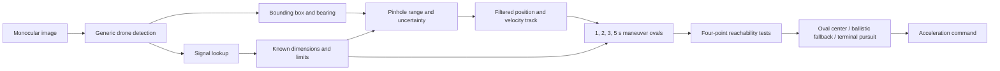

# ZENITH

ZENITH is a windowed interactive desktop proof-of-concept for vision-only interception. It estimates an intruder's range from a monocular camera, builds maneuver-reachability ovals, and outputs the maneuver for an interceptor. No radar, lidar, rangefinder, or target ground-truth coordinates are used by the guidance calculation.

The project includes five playable drones with distinct low-poly quadcopter, swept-wing, delta-wing, and blended-wing meshes. Two target-only rocket profiles add nose cones, cylindrical bodies, fins, exhausts, incoming-flight physics, and rocket-specific interception messages.


## Run it

On Windows, double-click `run_zenith.bat`. The application opens in a resizable 1280 × 800 window.

Or run it from a terminal:

```powershell
python -m pip install -r requirements.txt
python app.py
```

The installed environment needs Python 3.11+ and Pygame 2.6+.

## Recommended first demonstration

1. Keep `TALON-R` as our interceptor and `FALCON-X1` as the target.
2. Select `EVASIVE MANEUVERS`, `1920 × 1080`, and start the simulation.
3. Observe the target label change from `UNKNOWN / QUERYING` to `FALCON-X1`.
4. Point out the 1, 2, 3, and 5 second prediction ovals. Green extremes are reachable; red extremes are not.
5. Press `A` to show the camera-resolution and range-error analysis.
6. Press `V` to cycle through onboard, chase, and tactical views.
7. Press `-` to slow the terminal interception.
8. Start a new simulation, select `SKYFALL-R1` or `LANCE-M2` as the target, and demonstrate `ROCKET ATTACK`.
9. Press `E` to export the run's verification telemetry.

## Controls

| Key | Action |
|---|---|
| `Space` | Pause or continue |
| `+` / `-` | Change time scale from 0.25× to 4× |
| `V` | Cycle onboard, chase, and tactical views |
| `A` | Toggle engineering analysis |
| `H` | Toggle help |
| `E` | Export verification telemetry as CSV |
| `R` | Restart the current setup |
| `N` | Start a new setup |
| `Esc` | Close an overlay, then exit |

## What the four panels mean

- `TARGET VEHICLE`: drone or rocket specifications obtained after visual detection and simulated signal lookup.
- `CALCULATIONS`: focal length, apparent target size, estimated range, uncertainty, and camera-relative `Dx/Dy/Dz`.
- `OUR DRONE`: world position, velocity components, total speed, and acceleration.
- `RELATIVE`: camera-relative velocity, closing speed, contact time, selected guidance solution, reachable edges, and a clearly marked verification comparison.

`X` is camera-left/right, `Y` is camera-up/down, and `Z` is the line from the camera toward the target.

## System pipeline



The simulation's exact target position is used only to render the synthetic camera, detect physical contact, and calculate the explicitly marked verification error. The guidance path reads the camera detection, signal-resolved model data, and our drone's own integrated state.

## Verification

Run all six deterministic behavior tests:

```powershell
python verify_prototype.py --duration 30 --csv artifacts\verification.csv
python -m unittest discover -v
```

The verifier reports identification, interception result, hit time, minimum separation, and range-estimation MAE/RMSE. The automated test suite checks the camera model, coordinate basis, minimum-resolution formula, reachability ovals, signal state transition, model catalogue, and every default target behavior.

## Project structure

```text
app.py                    Desktop UI, setup screen, controls, CSV export
verify_prototype.py       Deterministic six-scenario verification
zenith/
  camera.py               Pinhole camera, detector output, range estimator
  guidance.py             Tracking, prediction ovals, reachability, commands
  math3d.py               Vector, camera-basis, and transform mathematics
  models.py               Five drones and two target-only rocket profiles
  meshes.py               Bundled procedural drone and rocket polygon meshes
  physics.py              Fixed 60 Hz acceleration, drag, brake, crash physics
  rendering.py            Software 3D scene, four-panel HUD, analysis display
  simulation.py           Detection → signal → guidance state machine
tests/test_core.py        Automated numerical and scenario checks
docs/TECHNICAL_REPORT.md  Equations, assumptions, degradation analysis
docs/PRESENTATION_GUIDE.md Suggested presentation and likely questions
```

## Prototype boundary

The generic visual detector is presently a deterministic synthetic-camera backend: it produces the box that an object detector would return from the rendered vehicle. Model identity deliberately does **not** come from that detector; it becomes available through the simulated post-detection signal lookup described in the project idea. The boundary is ready for a later YOLO/DINO adapter or imported Blender/glTF assets without changing the range, tracking, guidance, or HUD layers.

## Optional external model sources

The bundled meshes are original project code, so the prototype has no asset-license dependency. If higher-detail assets are wanted later:

- [NASA 3D Resources](https://science.nasa.gov/3d-resources/) provides downloadable rocket and spacecraft assets under NASA's media-usage guidance.
- [NASA Atlas V 401 glTF](https://science.nasa.gov/resource/atlas-v-401-3d-model/) is an official 2.08 MB rocket model.
- [Kira's Drone on Sketchfab](https://sketchfab.com/3d-models/drone-eac2b4bc20f54b3ba8c3ddbcdf03c8d6) is downloadable under CC Attribution, but its 275k triangles require simplification before use in this software renderer.
- [Khronos glTF Sample Assets](https://github.com/KhronosGroup/glTF-Sample-Assets) is a useful reference for a future standards-based importer; individual asset licenses must still be checked.
